пет проект для себя (не является конечным результатом, обновляется)

### Основные функции:
-  **Мониторинг системы** - CPU, RAM, Disk, Network в реальном времени
- ️ **Управление процессами** - просмотр, завершение, сортировка
-  **Управление службами** - запуск, остановка, перезапуск
- ️ **Компьютеры в сети** - сканирование и Active Directory
-  **RDP подключения** - быстрый доступ к удаленным компьютерам
-  **Управление пользователями** - создание, удаление, группы
-  **Группы AD** - создание групп в Active Directory с GPO
-  **Быстрый доступ** - запуск инструментов сисадмина
-  **Системные логи** - просмотр и фильтрация

### Технологии:
- Python 3.14
- PySide6 (Qt6)
- psutil
- pywin32
- ldap3
- pyqtgraph
- numpy

### Установка:
```bash
pip install PySide6 psutil pywin32 ldap3 numpy pyqtgraph
python main.py
```

##  Скриншоты

### Экран мониторинга
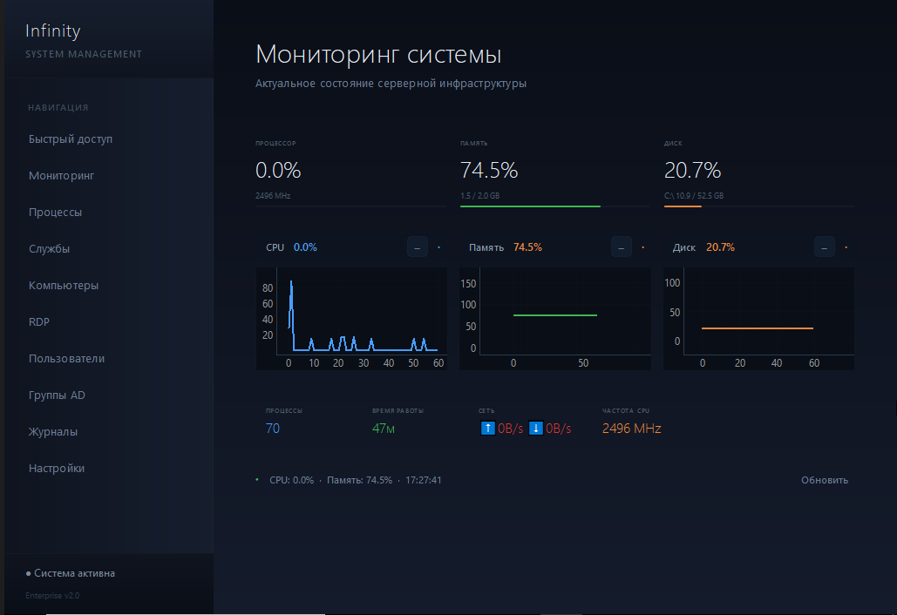

### Удаленное подключение
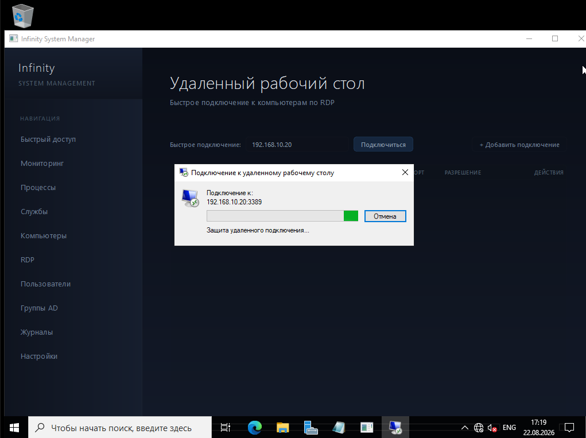

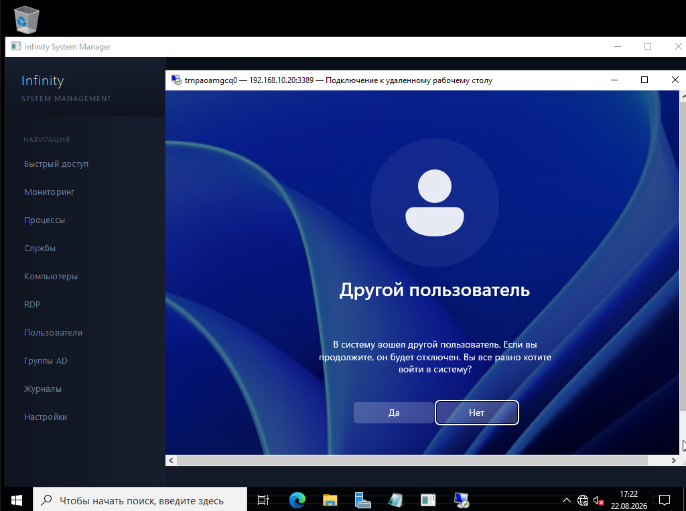

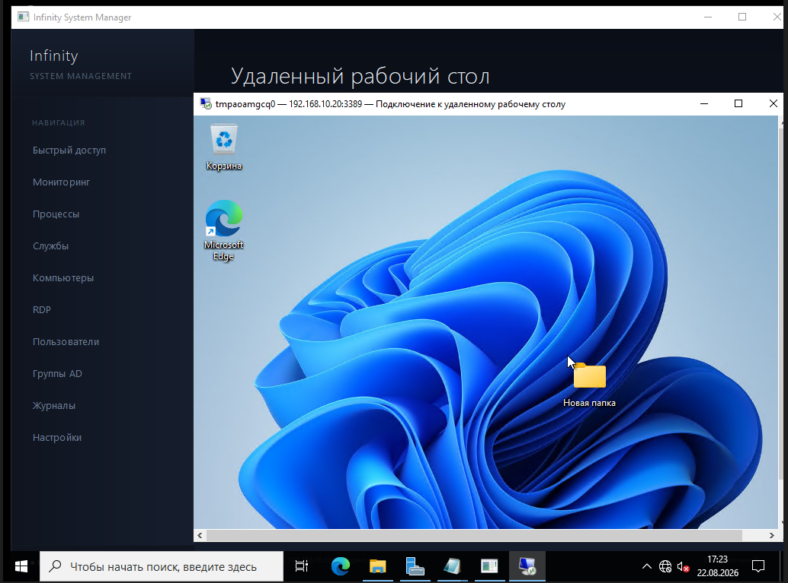
### Процессы
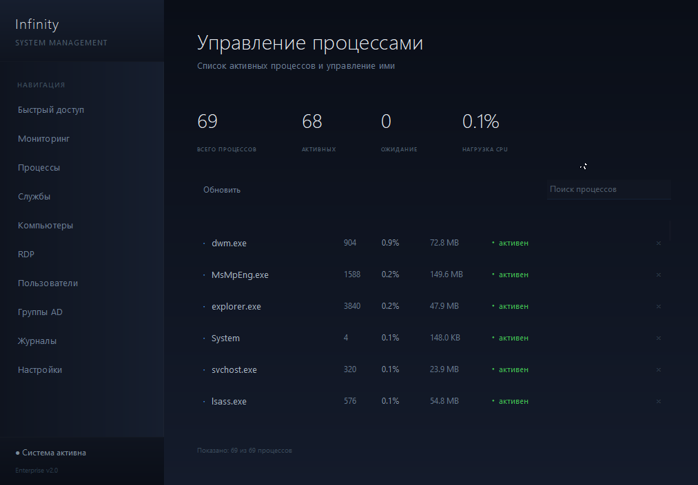

### Службы
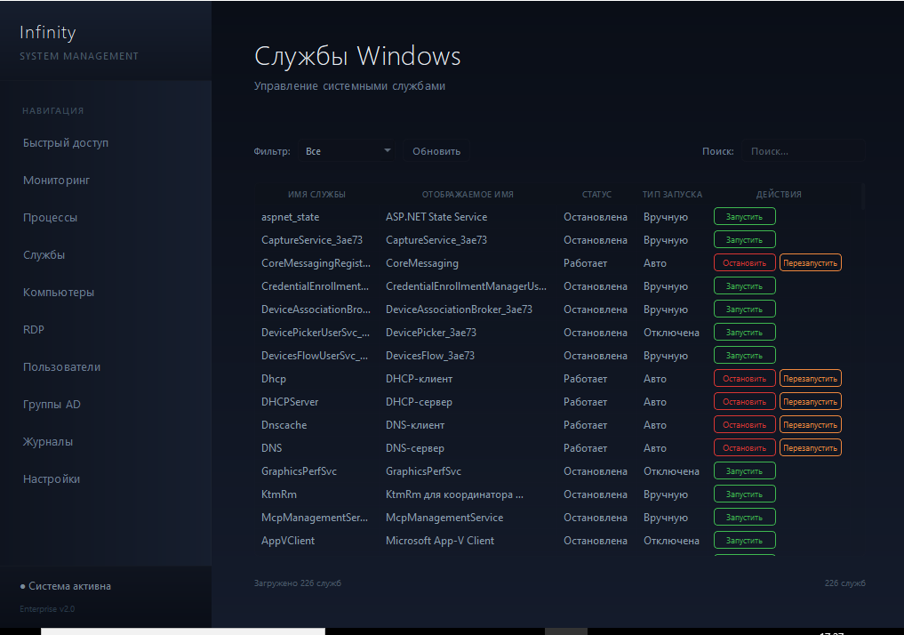

### Пользователи
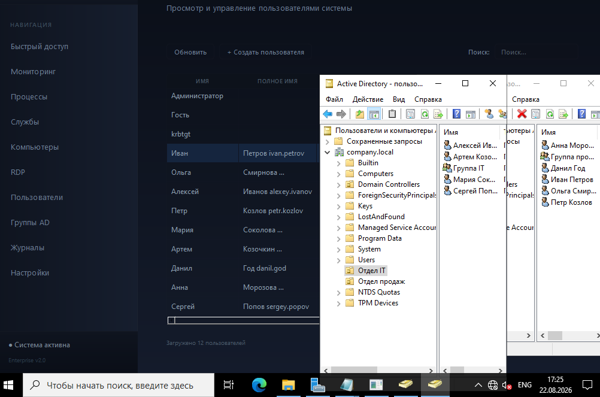

### Логи
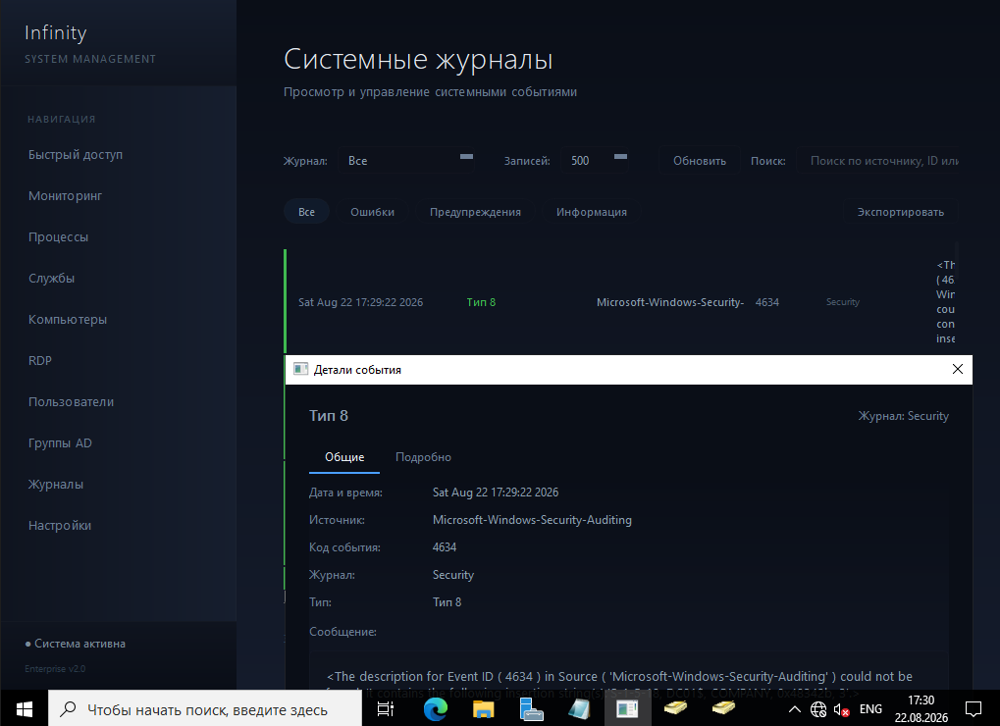

### Подключенные пк
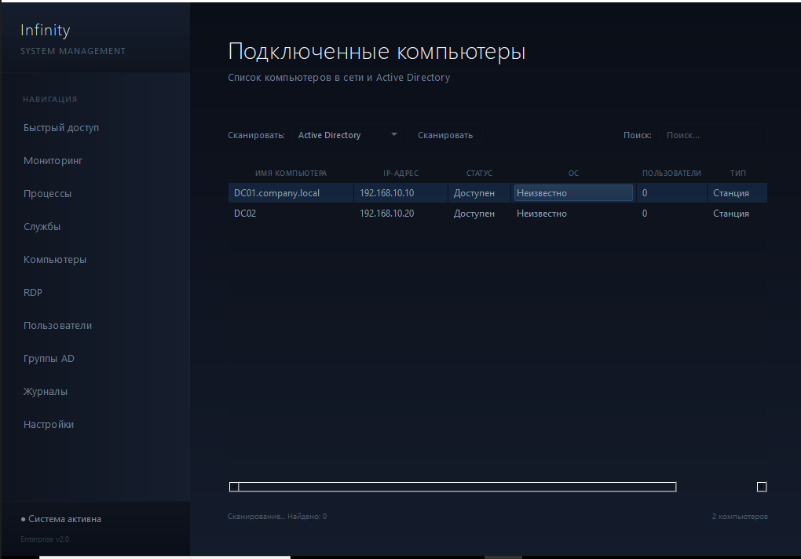

### Быстрый доступ
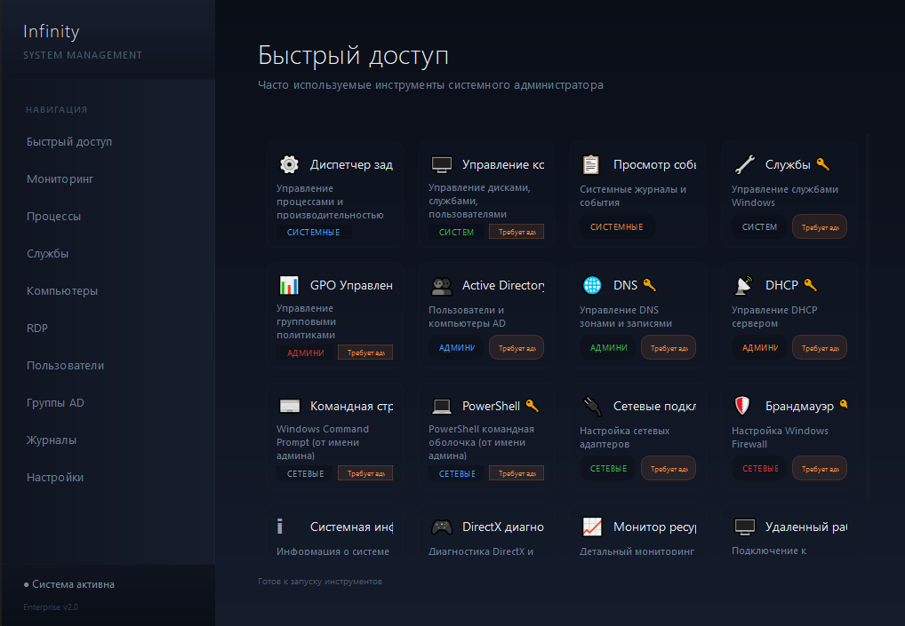

### Настройки
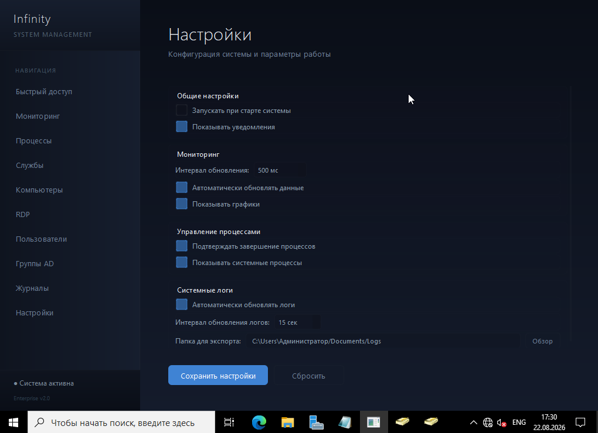
